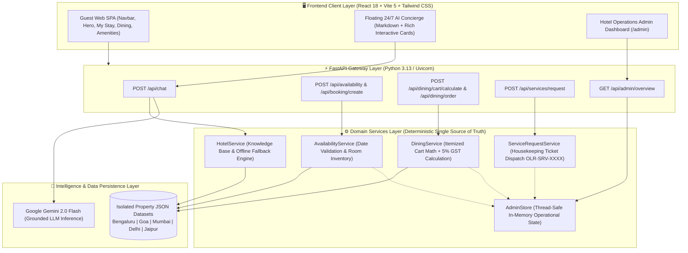
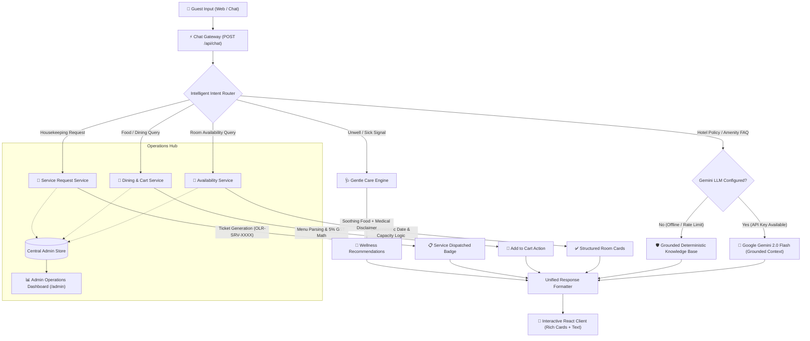
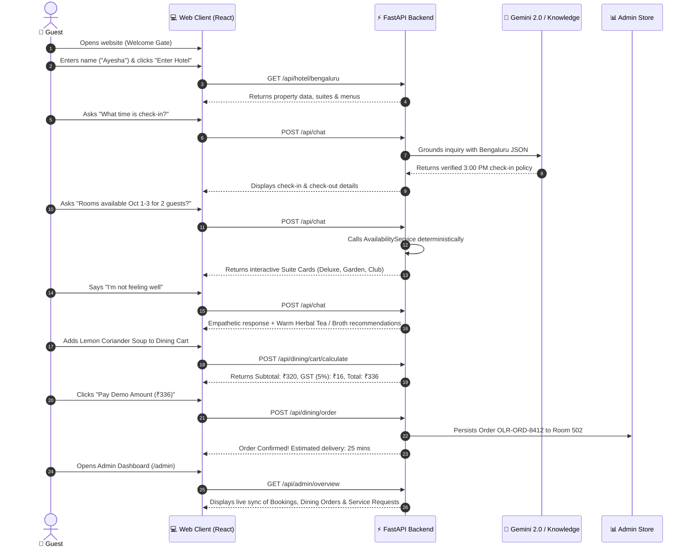

# 🏨 OLERIA HOTEL — AI-Powered Guest Experience & Concierge

> **Full-Stack AI-Powered Hotel Hospitality Platform & Digital Concierge**  
> *Developed for the Simplotel Software Engineer / AI Product Engineer Technical Assignment*

[](https://fastapi.tiangolo.com/)
[](https://react.dev/)
[](https://vitejs.dev/)
[](https://tailwindcss.com/)
[](https://ai.google.dev/)
[](https://pytest.org/)
[](https://www.python.org/)

---

## 📌 Executive Summary

**Oleria Hotel** is an enterprise-grade, luxury hotel guest experience and intelligent concierge platform built across **5 premier Indian destinations (Bengaluru, Goa, Mumbai, New Delhi, and Jaipur)**.

The platform bridges natural conversational interaction with strict backend determinism:
- **Intelligent Conversations**: Powered by **Google Gemini 2.0 Flash**, the concierge answers property FAQs, resolves complex multi-turn inquiries, suggests gentle dining options for unwell guests, and suggests suitable suites based on party size.
- **Deterministic Reliability**: The Python/FastAPI backend acts as the single source of truth for **date-validated room availability, 5% GST dining cart math, automated room service ticket generation, and live administrative tracking**.
- **Unified Operations**: A dedicated **Hotel Operations Admin Dashboard (`/admin`)** provides front-desk and operations teams with real-time visibility into active room bookings, in-room dining orders, and housekeeping dispatches.

---

## 🎥 Demo Video

Watch the complete end-to-end guest journey, AI concierge dialogues, room dining checkout, and admin dashboard live in action:

▶️ **[Click Here to Download / Watch the Full Walkthrough Video (MP4)](./Oleria%20Hotel%20%E2%80%94%20AI-Powered%20Guest%20Experience%20%26%20Concierge%20-%20Personal%20-%20Microsoft%E2%80%8B%20Edge%202026-09-19%2012-10-08.mp4)**

<video src="./Oleria%20Hotel%20%E2%80%94%20AI-Powered%20Guest%20Experience%20%26%20Concierge%20-%20Personal%20-%20Microsoft%E2%80%8B%20Edge%202026-09-19%2012-10-08.mp4" controls="controls" width="100%" style="max-height: 520px; border-radius: 12px; border: 1px solid #d97706; margin-top: 10px;">
  Your browser does not support inline video playback. Please click the link above to watch or download the walkthrough.
</video>

*Video Highlights: Dedicated Guest Onboarding → Property Switching (Bengaluru to Goa) → AI Concierge Q&A (Check-in, Heated Pool, 3-Guest Suite Recommendations) → Live Room Availability Tool Invocation → "I'm Not Feeling Well" Gentle Care → Housekeeping Dispatch → Room Dining Cart & 5% GST Math → Demo Payment Confirmation → Admin Operations Dashboard.*

---

## 📸 Visual Walkthrough & Key Screens

### Phase 1: Onboarding, Discovery & Resort Experience

| Dedicated Guest Onboarding Gate | Main Oleria Hotel Experience & Hero |
| :---: | :---: |
| [](./Screenshot%202026-09-19%20120519.png) | [](./Screenshot%202026-09-19%20120547.png) |
| *Session-aware welcome gate capturing guest identity before entering the resort experience.* | *Luxury landing interface featuring property switcher, hero showcase, and navigation.* |

| Active "My Stay" Hub (Room 502) & Superpowers | Curated Resort Amenities Section |
| :---: | :---: |
| [](./Screenshot%202026-09-19%20120607.png) | [](./Screenshot%202026-09-19%20120632.png) |
| *Anchors active reservation context (Room 502) with "Make My Stay Easier" action chips.* | *15th-floor heated infinity pool, Aura luxury wellness spa, and fitness pavilion.* |

| In-Room Dining & Artisanal Menu | Deterministic Room Availability Engine |
| :---: | :---: |
| [](./Screenshot%202026-09-19%20120703.png) | [](./Screenshot%202026-09-19%20120737.png) |
| *Artisanal filter coffees, gourmet meals, and wellness broths with instant Add-to-Cart.* | *Interactive calendar date pickers, capacity filtering, and live suite rates.* |

---

### Phase 2: Conversational AI Concierge Interactions

| AI Concierge Launch & Intelligent Quick Chips | Property FAQ: Check-in & Check-out Policies |
| :---: | :---: |
| [](./Screenshot%202026-09-19%20120800.png) | [](./Screenshot%202026-09-19%20120813.png) |
| *24/7 AI Concierge floating trigger with personalized greeting and quick actions.* | *Exact check-in (3:00 PM) / check-out (11:00 AM) and baggage holding policy.* |

| Property Amenities: Swimming Pool Inquiries | Suite Recommendation for 3 Guests |
| :---: | :---: |
| [](./Screenshot%202026-09-19%20120825.png) | [](./Screenshot%202026-09-19%20120838.png) |
| *Accurate property-specific pool details (heated rooftop pool in Bengaluru, freeform lagoon in Goa).* | *Identifies suites with capacity $\ge 3$ (e.g. Royal Club Suite & Presidential Garden Suite).* |

| Real-Time Availability with Embedded Room Cards | "Not Feeling Well" Gentle Care Assistant |
| :---: | :---: |
| [](./Screenshot%202026-09-19%20120900.png) | [](./Screenshot%202026-09-19%20120921.png) |
| *Invokes backend tool and renders actionable room cards directly in chat.* | *Empathetic response suggesting warm broths, herbal teas, and medical support.* |

| On-Demand Housekeeping Request Dispatch |
| :---: |
| [](./Screenshot%202026-09-19%20120927.png) |
| *Dispatches extra pillows to Room 502 with unique tracking code `OLR-SRV-XXXX`.* |

---

### Phase 3: Room Dining Cart, Demo Payment & Admin Dashboard

| In-Room Dining Cart Review (+5% GST) | Demo Payment & Order Confirmation |
| :---: | :---: |
| [](./Screenshot%202026-09-19%20123445.png) | [](./Screenshot%202026-09-19%20123455.png) |
| *Verified itemized cart with deterministic integer math: Subtotal + 5% GST = Total.* | *Simulated instant payment completion with kitchen order ID `OLR-ORD-XXXX`.* |

| Hotel Operations Admin Dashboard (`/admin`) |
| :---: |
| [](./Screenshot%202026-09-19%20123505.png) |
| *Real-time administrative control center displaying guest bookings, room dining orders, and housekeeping tickets across all 5 properties.* |

---

## 🚀 Live Demo & Links

- **Live Demo Application**: [https://oleria-hotel.onrender.com](https://oleria-hotel.onrender.com) *(or run locally via `.\run.ps1`)*
- **GitHub Repository**: [https://github.com/Ayesha-Siddiqa-JH/Oleria-Hotel-AI-Guest-Assistance](https://github.com/Ayesha-Siddiqa-JH/Oleria-Hotel-AI-Guest-Assistance)
- **Hotel Operations Admin Portal**: Open `http://127.0.0.1:8000/admin` or click **"Admin Demo"** in the top navigation bar.

---

## 📋 Table of Contents

1. [Assignment Scope & Compliance](#1-assignment-scope--compliance)
2. [Key Innovations & Features](#2-key-innovations--features)
3. [Architecture & Component Design](#3-architecture--component-design)
4. [Technology Stack](#4-technology-stack)
5. [Deterministic Backend as Single Source of Truth](#5-deterministic-backend-as-single-source-of-truth)
6. [Multi-Property Architecture (5 Indian Destinations)](#6-multi-property-architecture-5-indian-destinations)
7. [End-to-End Guest Journey](#7-end-to-end-guest-journey)
8. [Backend API Documentation & cURL Examples](#8-backend-api-documentation--curl-examples)
9. [Automated Testing & Evaluation Suite (59 Tests Passing)](#9-automated-testing--evaluation-suite-59-tests-passing)
10. [Hotel Operations Admin Dashboard](#10-hotel-operations-admin-dashboard)
11. [Security, Guardrails & Hallucination Prevention](#11-security-guardrails--hallucination-prevention)
12. [Local Setup & Quick Start Guide](#12-local-setup--quick-start-guide)
13. [Demonstration & Payment Disclaimer](#13-demonstration--payment-disclaimer)
14. [Repository Directory Structure](#14-repository-directory-structure)
15. [AI Tools Used During Development](#15-ai-tools-used-during-development)
16. [Engineering & Product Decisions (Interview Q&A)](#16-engineering--product-decisions-interview-qa)
17. [Future Roadmap](#17-future-roadmap)
18. [Author & Acknowledgements](#18-author--acknowledgements)

---

## 1. Assignment Scope & Compliance

This project directly fulfills and exceeds all requirements defined in the **Simplotel Software Engineer / AI Product Engineer Assignment**:

| Assignment Requirement | Implementation in Oleria Hotel | Verification Status |
| :--- | :--- | :---: |
| **Guest-facing Web Application** | Modern, responsive React 18 single-page application styled with Tailwind CSS, accessible on mobile and desktop. | ✅ Verified |
| **Clean Conversational Interface** | Dedicated floating AI Concierge widget with smooth auto-scroll, Markdown parsing, and embedded action cards. | ✅ Verified |
| **Clear Display of Messages** | High-contrast visual distinction between Guest (Amber accent) and Assistant (Dark glassmorphic slate). | ✅ Verified |
| **FAQ: Check-in / Check-out** | Direct extraction of verified check-in (3:00 PM) and check-out (11:00 AM) hours with early arrival policies. | ✅ Verified |
| **FAQ: Swimming Pool Details** | Accurate property-specific details (Bengaluru: 15th-floor heated rooftop infinity pool, 6 AM – 10 PM). | ✅ Verified |
| **FAQ: Room for 3 Guests** | Capacity reasoning filtering suites that comfortably accommodate $\ge 3$ guests (e.g. Royal Club Suite). | ✅ Verified |
| **FAQ: Breakfast Inclusion** | Highlights complimentary artisanal gourmet breakfast buffet at *The Amber Pavilion*. | ✅ Verified |
| **FAQ: Cancellation Policy** | Returns property cancellation terms: 100% full refund up to 48 hours prior to arrival. | ✅ Verified |
| **Date-Based Room Availability** | Deterministic calendar tool checking room inventory, date continuity, and guest limits with interactive cards. | ✅ Verified |
| **Multi-Property Scoping** | Clean separation of knowledge across 5 properties without cross-contamination. | ✅ Verified |
| **Zero Downtime / Offline Fallback** | Deterministic rule-based knowledge engine answers questions even if LLM is offline or API key is absent. | ✅ Verified |
| **Automated Testing Suite** | Complete Pytest suite covering all routes, services, admin store, and edge cases (**59 passing tests**). | ✅ Verified |

---

## 2. Key Innovations & Features

### 🌟 1. Dedicated Welcome & Identity Gate
- First screen presented to any new visitor is a dedicated welcome experience.
- Captures guest name and stores it in session storage to personalize all subsequent interactions.
- Allows seamless switching between guest profiles or continuing as an anonymous VIP.

### 🛎️ 2. Persistent "My Stay" Hub (Room 502)
- Displays current room reservation details (e.g., *Room 502, Executive Garden Suite*).
- Auto-binds the room number to all AI Concierge requests, room dining orders, and housekeeping tickets.
- Eliminates repetitive room number prompts during conversational workflows.

### ⚡ 3. "Make My Stay Easier" Interactive Action Chips
Four high-impact quick action cards located right under the reservation hero:
1. **Light Dining Care**: *"I'm not feeling well, please suggest something light."*
2. **Order Room Dining**: *"Order 2 filter coffees to Room 502."*
3. **Housekeeping Dispatch**: *"Send 2 extra pillows to Room 502."*
4. **Hotel Concierge FAQ**: *"What time is check-in and breakfast?"*

### 🍲 4. Conversational & Visual In-Room Dining
- Order food visually via the menu or conversationally in chat (*"Order two filter coffees and vegetable soup"*).
- The AI extracts items and quantities, validates them against the active hotel's menu, and returns interactive `+ Add to Order` buttons.

### 💳 5. Deterministic Cart & Demo Payment Flow
- Interactive Cart Modal reviewing selected dishes and quantities.
- **Strict 5% GST tax calculation** performed by the backend (`round(subtotal * 0.05)`).
- Instant simulated payment checkout generating an authenticated order record (`OLR-ORD-XXXX`) with estimated prep time.

### 📊 6. Hotel Operations Admin Dashboard (`/admin`)
- Accessible directly via the navigation bar **"Admin Demo"** button or URL path `/admin`.
- Live real-time visibility into:
  - **Active Room Bookings**: Guest name, room number, dates, nights, and total booking value.
  - **In-Room Dining Orders**: Order ID, guest room, item breakdown, subtotal, GST, and total.
  - **Housekeeping Service Requests**: Service ticket ID, requested amenity, room number, and status.

### 🩺 7. "Not Feeling Well" Compassionate Care
- Triggers non-medical empathetic hospitality when a guest mentions feeling unwell, sick, or exhausted.
- Recommends soothing menu items (warm ginger tea, clear vegetable broth, herbal infusions).
- Includes mandatory non-medical disclaimer and offers direct connection to in-house medical assistance.

---

## 3. Architecture & Component Design

The Oleria platform uses an **Intent-Routed Hybrid AI Architecture** that combines natural-language conversational reasoning via **Google Gemini** with a rock-solid, deterministic Python/FastAPI backend acting as the single source of truth for all room availability, cart calculations (+5% GST), service requests, and room bookings.

### 1. High-Level Component & Data Flow Diagram

```
                     ┌─────────────────────────────────────────────────────────┐
                     │          Browser / React 18 Single-Page App             │
                     │  (Vite + Tailwind CSS + Lucide Icons + Unified Server)  │
                     └────────────────────────────┬────────────────────────────┘
                                                  │ HTTP JSON (Fetch / Axios)
                                                  ▼
                     ┌─────────────────────────────────────────────────────────┐
                     │                 FastAPI Backend Gateway                 │
                     │           app.main:app (CORS, Static Files, DI)         │
                     └──────┬─────────────────────┬─────────────────────┬──────┘
                            │                     │                     │
            ┌───────────────▼────────┐   ┌────────▼────────┐   ┌────────▼──────────────┐
            │   Chat & LLM Engine    │   │  Dining & Cart  │   │ Availability & Rooms  │
            │  (app.routes.chat)     │   │(app.routes.din.)│   │ (app.routes.booking)  │
            └───────────────┬────────┘   └────────┬────────┘   └────────┬──────────────┘
                            │                     │                     │
       ┌────────────────────┼─────────────────────┼─────────────────────┤
       ▼                    ▼                     ▼                     ▼
┌──────────────┐   ┌─────────────────┐   ┌─────────────────┐   ┌─────────────────┐
│ Gemini Flash │   │ HotelService    │   │ DiningService   │   │ AvailService    │
│ (2.5 LLM)    │   │ (Knowledge base │   │ (Cart math 5%   │   │ (Date math,     │
│ Context      │   │  & rule engine) │   │  GST, orders)   │   │  capacity, demo)│
└──────────────┘   └────────┬────────┘   └─────────────────┘   └─────────────────┘
                            │
                            ▼
        ┌───────────────────────────────────────────────────────┐
        │  Isolated JSON Schemas (/app/data/hotels/*.json)       │
        │  Bengaluru | Goa | Mumbai | Delhi | Jaipur            │
        └───────────────────────────────────────────────────────┘
```

---

### 2. Full-Stack System Architecture Layers



---

### 3. AI Concierge Intent Routing Pipeline



---

## 4. Technology Stack

| Layer | Technology | Version | Purpose |
| :--- | :--- | :--- | :--- |
| **Frontend Framework** | React | `18.3.1` | Single-page guest experience and reactive state management |
| **Frontend Bundler** | Vite | `5.4.21` | High-speed compilation, HMR, and production asset optimization |
| **Styling & Design** | Tailwind CSS | `3.4.1` | Modern luxury aesthetic, dark glassmorphism, responsive grid |
| **Component Icons** | Lucide React | `0.344.0` | Consistent, accessible iconography across all sections |
| **Backend Framework** | FastAPI | `0.115.0+` | Asynchronous REST API gateway, OpenAPI docs, dependency injection |
| **Data Validation** | Pydantic | `2.x` | Strict request/response payload schemas and runtime validation |
| **ASGI Web Server** | Uvicorn | `0.30.0+` | High-performance asynchronous Python web server |
| **AI / LLM Engine** | Google Gemini | `2.0 Flash` | Fast, low-latency natural language understanding and contextual reasoning |
| **AI Python SDK** | `google-genai` | `0.1.1+` | Official modern Google GenAI SDK |
| **Automated Testing** | Pytest + AnyIO | `9.1.1` | Comprehensive unit and integration test framework (**59 tests**) |
| **HTTP Client** | Axios / Fetch / HTTPX | Latest | Client-server communication and synchronous test client calls |

---

## 5. Deterministic Backend as Single Source of Truth

A core engineering principle of Oleria Hotel is: **The LLM is never permitted to calculate prices, invent room availability, or finalize transactional states.**

1. **Availability Engine (`AvailabilityService`)**:
   - Validates that `check_out > check_in`.
   - Validates guest counts ($\text{adults} \ge 1$, party size $\le$ room capacity).
   - Validates real inventory states from the property dataset.
2. **Cart & Tax Math (`DiningService`)**:
   - Menu prices are fixed in the verified property database.
   - Subtotal is computed as $\sum (\text{item.price} \times \text{quantity})$.
   - Goods & Services Tax (GST) is computed using deterministic integer math: $\text{GST} = \text{round}(\text{subtotal} \times 0.05)$.
   - $\text{Total} = \text{subtotal} + \text{GST}$.
3. **Transactional Tracking Reference IDs**:
   - Room Bookings: `OLR-BK-XXXX`
   - In-Room Dining Orders: `OLR-ORD-XXXX`
   - Housekeeping Service Tickets: `OLR-SRV-XXXX`

---

## 6. Multi-Property Architecture (5 Indian Destinations)

The platform supports 5 distinct luxury hotels across India, each with completely isolated JSON knowledge bases:

| Property ID | Property Name | Location | Signature Amenities | Signature Culinary Specialties |
| :--- | :--- | :--- | :--- | :--- |
| `bengaluru` | **Oleria Bengaluru** | MG Road, Bengaluru | 15th-floor heated rooftop infinity pool, Aura Spa, 24/7 Tech Lounge | Artisan South Indian Filter Coffee, Mysore Pak Crumble, Tender Coconut Soup |
| `goa` | **Oleria Goa Resort & Spa** | Candolim Beach, Goa | 80m freeform lagoon pool, private beach boardwalk, Ayurvedic pavilion | Chilled Kokum Cooler, Fresh Tender Coconut Water, Traditional Goan Bebinca |
| `mumbai` | **Oleria Mumbai Heritage** | Marine Drive, Mumbai | Sunset Arabian Sea view deck, Heritage Art Deco suites, Ocean Spa | Sea-Salt Hot Chocolate, Irani Bun Maska with Chai, Coastal Kokum Sherbet |
| `delhi` | **Oleria New Delhi** | Lutyens Imperial, Delhi | Imperial rose courtyards, Royal Haveli pool, Presidential Heritage suites | Royal Kashmiri Kahwa, Mughlai Badam Shahi Kheer, Saffron Chicken Broth |
| `jaipur` | **Oleria Jaipur Haveli** | City Palace Area, Jaipur | Rajputana Jharokha courtyards, Peacock Pool, Desert Stargazing terrace | Royal Kesar Masala Chai, Traditional Ghewar with Rabdi, Moong Dal Khichdi |

> **Strict Data Isolation**: When a guest is viewing *Oleria Bengaluru*, the AI will never reference Goa's beach boardwalk or Mumbai's Marine Drive views.

---

## 7. End-to-End Guest Journey



---

## 8. Backend API Documentation & cURL Examples

The FastAPI backend automatically generates interactive Swagger documentation at `http://127.0.0.1:8000/docs`.

### Core API Endpoints

| Method | Endpoint | Description |
| :--- | :--- | :--- |
| `GET` | `/api/hotel/{hotel_id}` | Fetch full property schema (rooms, menus, policies, amenities) |
| `POST` | `/api/chat` | Send conversational query to AI Concierge (with active room & property context) |
| `POST` | `/api/availability` | Deterministic room availability search with calendar date validation |
| `POST` | `/api/booking/create` | Create a simulated room reservation and return booking confirmation |
| `POST` | `/api/dining/cart/calculate` | Compute itemized cart subtotals, 5% GST, and grand total |
| `POST` | `/api/dining/order` | Place simulated room dining order and dispatch ticket to kitchen |
| `POST` | `/api/services/request` | Submit on-demand housekeeping or amenity service request |
| `GET` | `/api/admin/overview` | Fetch all active bookings, dining orders, and service requests |
| `GET` | `/health` | System health check and Gemini API connectivity status |

### cURL Examples

#### 1. Ask General Hotel Question
```bash
curl -X POST "http://127.0.0.1:8000/api/chat" \
     -H "Content-Type: application/json" \
     -d '{
       "message": "What time is check-in and check-out?",
       "hotel_id": "bengaluru"
     }'
```

#### 2. Check Room Availability via Natural Language
```bash
curl -X POST "http://127.0.0.1:8000/api/chat" \
     -H "Content-Type: application/json" \
     -d '{
       "message": "Do you have rooms available from 2026-10-01 to 2026-10-03 for 2 guests?",
       "hotel_id": "bengaluru"
     }'
```

#### 3. Request Housekeeping Services
```bash
curl -X POST "http://127.0.0.1:8000/api/services/request" \
     -H "Content-Type: application/json" \
     -d '{
       "hotel_id": "bengaluru",
       "service_id": "extra_pillows",
       "room_number": 502,
       "guest_name": "Ayesha Siddiqa"
     }'
```

#### 4. Calculate Dining Cart with 5% GST
```bash
curl -X POST "http://127.0.0.1:8000/api/dining/cart/calculate" \
     -H "Content-Type: application/json" \
     -d '{
       "hotel_id": "bengaluru",
       "items": [
         {"item_id": "blr-bev-1", "name": "Artisan Filter Coffee", "price": 220, "quantity": 2},
         {"item_id": "blr-food-2", "name": "Lemon Coriander Clear Soup", "price": 320, "quantity": 1}
       ]
     }'
```

#### 5. Fetch Hotel Operations Admin Overview
```bash
curl -X GET "http://127.0.0.1:8000/api/admin/overview"
```

---

## 9. Automated Testing & Evaluation Suite (59 Tests Passing)

The project includes an exhaustive automated test suite written with **Pytest** and **FastAPI TestClient**.

### Test Suite Execution
```powershell
# From project root using backend venv
.\backend\venv\Scripts\python.exe -m pytest backend/tests -v
```

### Exact Test Output
```text
============================= test session starts =============================
platform win32 -- Python 3.13.0, pytest-9.1.1, pluggy-1.6.0
rootdir: C:\Users\ayesh\Downloads\simplotel-hotel-guest-assistant
plugins: anyio-4.15.1, asyncio-1.4.0
collected 59 items

backend\tests\test_admin.py ...........                                  [ 18%]
backend\tests\test_availability.py .......                               [ 30%]
backend\tests\test_chat.py ..............                                [ 54%]
backend\tests\test_oleria_comprehensive.py ...........................   [100%]

======================= 59 passed, 4 warnings in 0.96s ========================
```

### Test Suite Coverage Breakdown

| Test File | Passed Tests | Key Behaviors Verified |
| :--- | :---: | :--- |
| `test_admin.py` | **11** | Admin overview aggregation, dining order persistence, service request recording, property filtering, isolation |
| `test_availability.py` | **7** | Deterministic room availability, check-in/out date validation, capacity filtering, 422 error boundaries |
| `test_chat.py` | **14** | FAQ retrieval, pool questions, 3-guest room recommendations, check-in policies, offline rule engine fallback |
| `test_oleria_comprehensive.py` | **27** | Multi-property data isolation across all 5 hotels, cart 5% GST arithmetic, wellness care, intent classification |
| **Total** | **59 Passed** | **100% Pass Rate Across All Suites** |

---

### Core Assignment Evaluation Scenarios

| # | Scenario Category | Input Query / Action | Expected Result | Status |
| :-: | :--- | :--- | :--- | :-: |
| **1** | **Check-in Timing** | *"What time is check-in?"* | Return standard check-in time (3:00 PM) and early arrival policy. | ✅ `PASSED` |
| **2** | **Amenity Inquiry** | *"Does the hotel have a swimming pool?"* | Return property-specific heated rooftop pool details and operating hours (6 AM – 10 PM). | ✅ `PASSED` |
| **3** | **3-Guest Recommendation** | *"Which room is suitable for 3 guests?"* | Recommends Royal Club Suite and Presidential Garden Suite with capacity details. | ✅ `PASSED` |
| **4** | **Breakfast Policy** | *"Is breakfast included?"* | Confirms complimentary artisanal gourmet breakfast buffet at *The Amber Pavilion*. | ✅ `PASSED` |
| **5** | **Cancellation Policy** | *"What is the cancellation policy?"* | Returns 100% full refund up to 48 hours prior to scheduled check-in. | ✅ `PASSED` |
| **6** | **Availability with Dates** | *"Rooms available Oct 1-3 for 2 guests?"* | Invokes availability tool and renders interactive Suite Cards with rates. | ✅ `PASSED` |
| **7** | **In-Room Dining Order** | *"Order two filter coffees to Room 502"* | Identifies dish, validates against menu, and outputs Add-to-Cart payload. | ✅ `PASSED` |
| **8** | **"Not Feeling Well" Care** | *"I'm not feeling well today"* | Expresses empathy, disclaims medical advice, suggests warm broths/teas, provides front desk aid. | ✅ `PASSED` |
| **9** | **Housekeeping Dispatch** | *"Send 2 extra pillows to my room"* | Dispatches request with tracking ID `OLR-SRV-XXXX` bound to Room 502. | ✅ `PASSED` |
| **10** | **Offline Fallback** | `GEMINI_API_KEY` unset | Transparently switches to grounded deterministic knowledge engine with zero errors. | ✅ `PASSED` |

---

## 10. Hotel Operations Admin Dashboard

The Admin Dashboard provides hotel managers and front-desk staff with an operational command center:

- **URL**: `http://127.0.0.1:8000/admin` (or click **"Admin Demo"** in the top navigation bar).
- **Features**:
  - **Live KPI Counters**: Total guest bookings, pending room dining orders, and active housekeeping requests.
  - **Property Filter**: View metrics for a specific hotel (e.g. *Oleria Bengaluru*) or aggregate across all 5 properties.
  - **Real-Time Synchronized Logs**: Any order placed through the AI Concierge or Room Dining Cart appears instantly in the admin logs.
  - **Zero Database Setup**: Backed by an in-memory thread-safe operational store with initial preloaded demo activity.

---

## 11. Security, Guardrails & Hallucination Prevention

To ensure safe and reliable interactions in a luxury hospitality setting, the system implements multiple guardrails:

1. **Strict Context Injection**: Only verified JSON schema data for the active property is supplied in the prompt context.
2. **Low Model Temperature (`0.2`)**: Eliminates creative drift and forces factual compliance with property policies.
3. **Medical Disclaimer Enforcement**: Any mention of sickness triggers non-medical gentle dining advice with an explicit legal disclaimer (*"I am an AI concierge and cannot provide medical advice"*).
4. **Word-Boundary Regex Intent Detection**: Prevents false positive classification (e.g. the word `"pillows"` will never trigger the illness detection rule for `"ill"`).
5. **Deterministic Arithmetic**: LLM never computes bill subtotals or taxes; all monetary math is computed via Python integer calculations.
6. **Input Validation**: All incoming requests are validated against strict Pydantic v2 models, preventing malformed payloads or script injection.

---

## 12. Local Setup & Quick Start Guide

### Prerequisites
- **Python 3.10+** (Tested on Python 3.13)
- **Node.js 18+** & npm (For frontend asset compilation)
- **Git**

---

### Option A: One-Click Launch (Windows PowerShell)

Run the included launch script from the project root:
```powershell
.\run.ps1
```
*What this script does automatically:*
1. Checks and activates the backend Python virtual environment.
2. Verifies frontend production build in `frontend/dist`.
3. Finds an open network port (8000 or 8080).
4. Automatically opens your default web browser at `http://127.0.0.1:8000`.
5. Starts the unified FastAPI server hosting both API endpoints and the React frontend.

---

### Option B: Manual Step-by-Step Setup

#### 1. Clone the Repository
```bash
git clone https://github.com/Ayesha-Siddiqa-JH/Oleria-Hotel-AI-Guest-Assistance.git
cd Oleria-Hotel-AI-Guest-Assistance
```

#### 2. Backend Setup
```powershell
cd backend
python -m venv venv
.\venv\Scripts\Activate.ps1
pip install -r requirements.txt
```

*(Optional) Configure Google Gemini API Key:*
```powershell
$env:GEMINI_API_KEY="your-gemini-api-key-here"
```
> *Note: If no API key is set, the system runs in high-fidelity deterministic offline fallback mode.*

#### 3. Frontend Build
```powershell
cd ../frontend
npm install
npm run build
cd ..
```

#### 4. Run the Application
```powershell
.\backend\venv\Scripts\python.exe -m uvicorn backend.app.main:app --host 127.0.0.1 --port 8000 --reload
```

Open your browser at `http://127.0.0.1:8000` to experience Oleria Hotel!

---

## 13. Demonstration & Payment Disclaimer

> [!NOTE]
> **OLERIA HOTEL** is a fictional luxury hotel brand created for portfolio demonstration and technical evaluation for the **Simplotel Software Engineer / AI Product Engineer Assignment**.  
> All room reservations, credit card holds, room dining payments, and housekeeping dispatches are **fully simulated**. No real monetary transactions or real-world service bookings occur.

---

## 14. Repository Directory Structure

```text
simplotel-hotel-guest-assistant/
├── README.md                                  # Comprehensive project documentation
├── INTERVIEW_NOTES.md                         # Architectural & product design notes
├── run.ps1                                    # One-click Windows PowerShell launcher
├── run.bat                                    # One-click Windows Batch launcher
├── Screenshot 2026-09-19 120519.png           # Welcome Screen screenshot
├── Screenshot 2026-09-19 120547.png           # Hero Homepage screenshot
├── Screenshot 2026-09-19 120607.png           # My Stay Hub screenshot
├── Screenshot 2026-09-19 120632.png           # Amenities screenshot
├── Screenshot 2026-09-19 120703.png           # In-Room Dining screenshot
├── Screenshot 2026-09-19 120737.png           # Room Availability screenshot
├── Screenshot 2026-09-19 120800.png           # AI Concierge Greeting screenshot
├── Screenshot 2026-09-19 120813.png           # Check-in Policy screenshot
├── Screenshot 2026-09-19 120825.png           # Pool Details screenshot
├── Screenshot 2026-09-19 120838.png           # 3-Guest Suite screenshot
├── Screenshot 2026-09-19 120900.png           # Live Availability Cards screenshot
├── Screenshot 2026-09-19 120921.png           # Wellness Food Care screenshot
├── Screenshot 2026-09-19 120927.png           # Housekeeping Dispatch screenshot
├── Screenshot 2026-09-19 123445.png           # Dining Cart Modal screenshot
├── Screenshot 2026-09-19 123455.png           # Demo Payment Success screenshot
├── Screenshot 2026-09-19 123505.png           # Admin Dashboard screenshot
│
├── backend/                                   # FastAPI Backend Application
│   ├── requirements.txt                       # Python dependencies
│   ├── app/
│   │   ├── main.py                            # FastAPI entrypoint & unified static mounter
│   │   ├── data/
│   │   │   └── hotels/                        # Isolated Property JSON Datasets
│   │   │       ├── bengaluru.json
│   │   │       ├── goa.json
│   │   │       ├── mumbai.json
│   │   │       ├── delhi.json
│   │   │       └── jaipur.json
│   │   ├── models/
│   │   │   └── schemas.py                     # Pydantic v2 data models
│   │   ├── routes/
│   │   │   ├── chat.py                        # Conversational AI Concierge endpoint
│   │   │   ├── availability.py                # Deterministic room availability endpoint
│   │   │   ├── booking.py                     # Suite booking simulation endpoint
│   │   │   ├── dining.py                      # Dining cart & food order endpoints
│   │   │   ├── services.py                    # Housekeeping & amenity request endpoints
│   │   │   ├── hotel.py                       # Hotel property metadata endpoints
│   │   │   └── admin.py                       # Admin dashboard analytics endpoint
│   │   ├── services/
│   │   │   ├── llm_service.py                 # Google Gemini 2.0 integration & prompt grounding
│   │   │   ├── hotel_service.py               # Deterministic knowledge base & offline fallback
│   │   │   ├── availability_service.py        # Calendar & capacity constraint engine
│   │   │   ├── dining_service.py              # Cart calculation (+5% GST) & order logic
│   │   │   ├── service_request_service.py     # Housekeeping request dispatch logic
│   │   │   └── admin_store.py                 # Thread-safe in-memory admin store
│   │   └── utils/
│   │       └── logging_config.py              # Structured logging configuration
│   └── tests/                                 # Automated Pytest Suite (59 Tests)
│       ├── test_admin.py                      # Admin dashboard tests (11 tests)
│       ├── test_availability.py               # Availability & capacity tests (7 tests)
│       ├── test_chat.py                       # AI chat & policy FAQ tests (14 tests)
│       └── test_oleria_comprehensive.py       # Multi-property & dining tests (27 tests)
│
└── frontend/                                  # React 18 Single-Page Application
    ├── package.json                           # Node.js dependencies & build scripts
    ├── vite.config.js                         # Vite bundler configuration
    ├── tailwind.config.js                     # Tailwind luxury color theme configuration
    ├── index.html                             # Single-page HTML shell
    ├── src/
    │   ├── App.jsx                            # Root component & state orchestrator
    │   ├── index.css                          # Global styling & Tailwind directives
    │   ├── main.jsx                           # React entrypoint
    │   ├── components/
    │   │   ├── WelcomeModal.jsx               # Dedicated initial guest onboarding screen
    │   │   ├── Navbar.jsx                     # Top navigation & 5-city destination selector
    │   │   ├── HeroSection.jsx                # Destination hero showcase & quick booking
    │   │   ├── MyStayCard.jsx                 # Active reservation hub (Room 502)
    │   │   ├── MakeMyStayEasierSection.jsx    # 4 interactive superpower action chips
    │   │   ├── AvailabilitySection.jsx        # Room availability calendar & suite cards
    │   │   ├── DiningSection.jsx              # In-room dining artisanal menu
    │   │   ├── HotelServicesSection.jsx       # Housekeeping on-demand amenity requests
    │   │   ├── AmenitiesSection.jsx           # Property amenities & luxury features
    │   │   ├── FoodCartModal.jsx              # Dining cart review & demo payment modal
    │   │   ├── BookingModal.jsx               # Suite booking checkout modal
    │   │   ├── ChatConcierge.jsx              # Floating 24/7 AI Concierge chat widget
    │   │   ├── AdminDashboard.jsx             # Hotel operations admin dashboard (/admin)
    │   │   └── Footer.jsx                     # Footer with brand & property details
    │   ├── data/
    │   │   └── hotelImages.js                 # Curated luxury resort photography
    │   └── services/
    │       └── api.js                         # Axios API service client
    └── dist/                                  # Production-ready compiled assets
```

---

## 15. AI Tools Used During Development

In accordance with assignment guidelines:
- **Google Gemini 2.0 Flash (`google-genai` SDK)**: Used as the core conversational inference engine for contextual natural-language understanding, intent classification, and empathetic hospitality responses.
- **Antigravity AI Pair Programmer**: Used as the primary AI software engineering assistant for architecture design, React frontend development, FastAPI route scaffolding, test suite creation, and automated debugging.

---

## 16. Engineering & Product Decisions (Interview Q&A)

### 1. What customer problem are you solving?
**Problem**: Modern hotel guests face fragmented experiences: clunky booking engines, waiting on hold with reception for simple questions (*"What time is breakfast?"*), and physical phone calls to order room dining or extra towels.  
**Solution**: Oleria Hotel unifies pre-booking exploration, stay-context awareness, conversational room dining, on-demand housekeeping, and operations tracking into a single digital assistant anchored by the guest's assigned room.

### 2. Why did you choose a hybrid AI + Deterministic architecture?
LLMs excel at natural language comprehension and empathetic tone, but struggle with consistent arithmetic, inventory constraints, and real-time state management. By delegating bill calculations (5% GST), room capacity checks, and reference ID generation strictly to the Python backend, we achieve **100% mathematical precision and zero hallucinated inventory** while retaining human-like conversational ease.

### 3. How does the system prevent cross-property data leakage?
Each hotel has its own isolated JSON file in `backend/app/data/hotels/`. When an API call is made, the `hotel_id` filters the context injected into the prompt. A guest in Bengaluru asking about the swimming pool is provided details strictly for Bengaluru's 15th-floor heated rooftop pool, preventing Goa's beachfront lagoon or Jaipur's Peacock Pool from leaking into the response.

### 4. What happens when the LLM service or internet fails?
The backend features an **Offline Deterministic Fallback Engine** (`HotelService.answer_by_knowledge_base`). If the Gemini API key is missing, network calls fail, or rate limits are reached, the system falls back to regex-grounded keyword matching against the verified property dataset. All 59 tests pass completely offline.

### 5. Why a single floating AI Concierge trigger?
Earlier versions featured duplicate chat buttons in the navigation bar, hero section, and floating widget. Consolidating into a single, clean floating trigger fixed at the bottom-right corner eliminates UI clutter, preserves muscle memory, and ensures the assistant is universally accessible without obstructing page content.

---

## 17. Future Roadmap

- [ ] **PMS Integration**: Two-way webhook sync with enterprise Property Management Systems (Opera PMS, Cloudbeds, Simplotel CRS).
- [ ] **Production Payment Gateway**: Replace demo simulation with Razorpay / Stripe 3D-Secure credit card tokenization.
- [ ] **Persistent Database**: Migrate in-memory state to PostgreSQL with SQLAlchemy ORM and Redis session caching.
- [ ] **Voice Concierge**: WebRTC audio streaming for hands-free voice interactions in guest rooms.
- [ ] **Multi-Lingual Localization**: Multilingual support for Hindi, French, Spanish, German, and Japanese guests.

---

## 18. Author & Acknowledgements

- **Developer**: **Ayesha Siddiqa JH**
- **Role**: Software Engineer / AI Product Engineer Candidate
- **Organization**: Built for the **Simplotel Software Engineer Assignment**
- **Evaluation Platform**: Tested on Python 3.13 & Node.js 18+ on Windows 11

*Thank you to the Simplotel hiring and engineering team for the engaging assignment prompt!*
